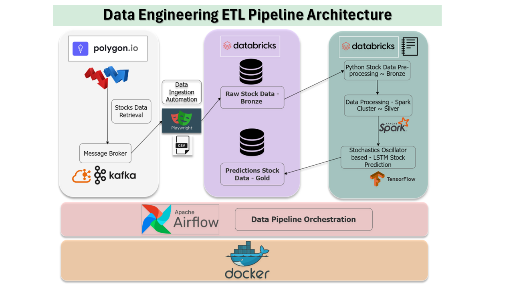

# StochastiCast ~ Enhancing Stock Market Predictions Using Stochastic Indicators

## Overview
The stock market is **highly dynamic, nonlinear, and influenced by multiple factors** such as politics, global economics, and company performance. Predicting stock prices with precision remains a challenge due to market volatility.
Analyzing **historical stock data** is crucial for identifying **profitable investment opportunities**. Financial analysts and data scientists continuously explore trends, applying analytical techniques to extract meaningful patterns. This has led to the rise of **algorithmic trading**, where pre-programmed trading strategies and technical indicators automate investment decisions.

## Stochastic Oscillator: A Key Indicator 1
One essential tool in technical analysis is the **stochastic oscillator**, which provides:
- **Overbought & oversold conditions**
- **Signal divergences**
- **Short-term vs. long-term trend analysis**

By comparing the latest closing price with the total price range over a specified period, stochastic values (**0 to 100**) help traders assess **market momentum**.

### Computing Stochastics
The stochastic indicator consists of two key components:
- **%K Line** – The raw, sensitive statistic reflecting price movements.
- **%D Line** – A smoothed moving average of **%K** derived from applying **3-period moving averages**. It reduces volatility and refines trading signals, offering clearer trend insights .

### Applications of Stochastics
Traders use stochastics for:
1. **Divergence Analysis** – Where overbought and oversold scenarios suggest **potential trend reversals** driven by buying and selling pressure. This involves identifying inconsistencies between price action and momentum signals.
2. **Crossovers** – Sell signal when **slow %K < %D**, buy signal when **slow %K > %D**.
3. **Overbought/Oversold Conditions** – Readings above **80% = overbought**, below **20% = oversold**. This is an indicator for sell and buy signals respectively.

1 Source: Steve Nison, _Japanese Candlestick Charting Techniques,_ 2nd ed. (New York, NY: New York Institute of Finance, 2001), 233-236.

## Project Objectives
 By integrating **stochastic analysis into trading strategies**, financial institutions can enhance forecasting accuracy and optimize capital gains.
This project focuses on:
- **Leveraging historical stock data for predictive analysis**
- **Developing automated strategies using stochastic oscillators**
- **Improving investment decisions through AI-driven insights**

## Data Engineering ETL Pipeline Architecture Diagram

     
      
     <em>Figure 1: Data Engineering ETL Pipeline Architecture Diagram</em>

